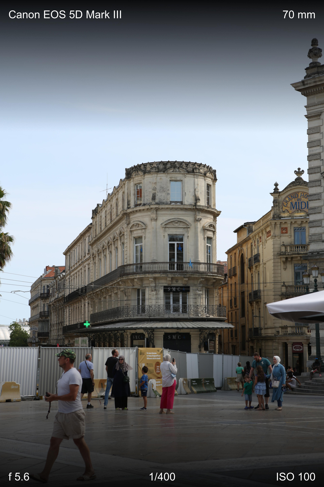

# CanonImageTagger
Simple Python tool for quickly adding image specs to your image. Adds information about camera, focal length, aperture, shutter speed and ISO to your images

## How To Use
1. Download the source code
2. Add a "input" and a "output" folder to the source codes directory
3. Run `python CleanWorkspace.py` if you want to remove all files from the input and output folders
4. Add the images you want to get tagged to the input directory
5. Run `python imageTagger.py`
6. Retrieve created Images from output directory

## Example Image

## Used Packages
- [exifread](https://pypi.org/project/ExifRead/)
- [pillow](https://pypi.org/project/pillow/)
- [glob](https://docs.python.org/3/library/glob.html)
- [time](https://docs.python.org/3/library/time.html)
